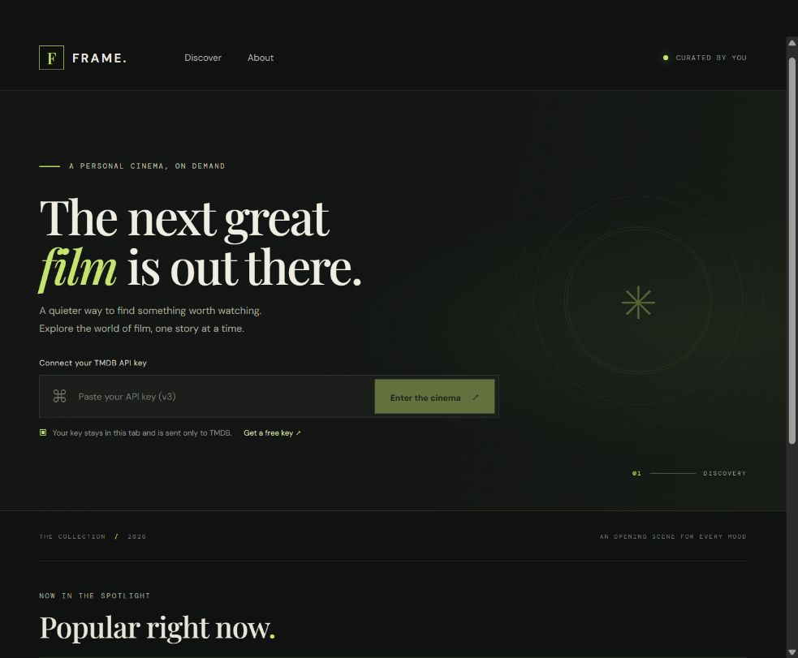
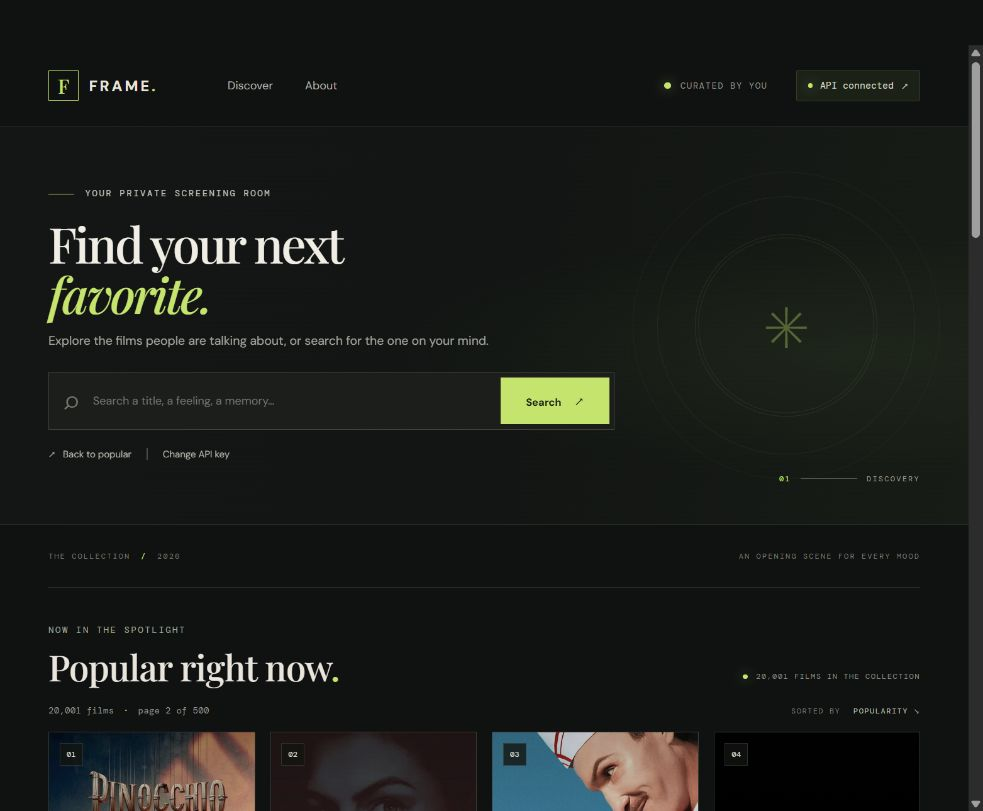
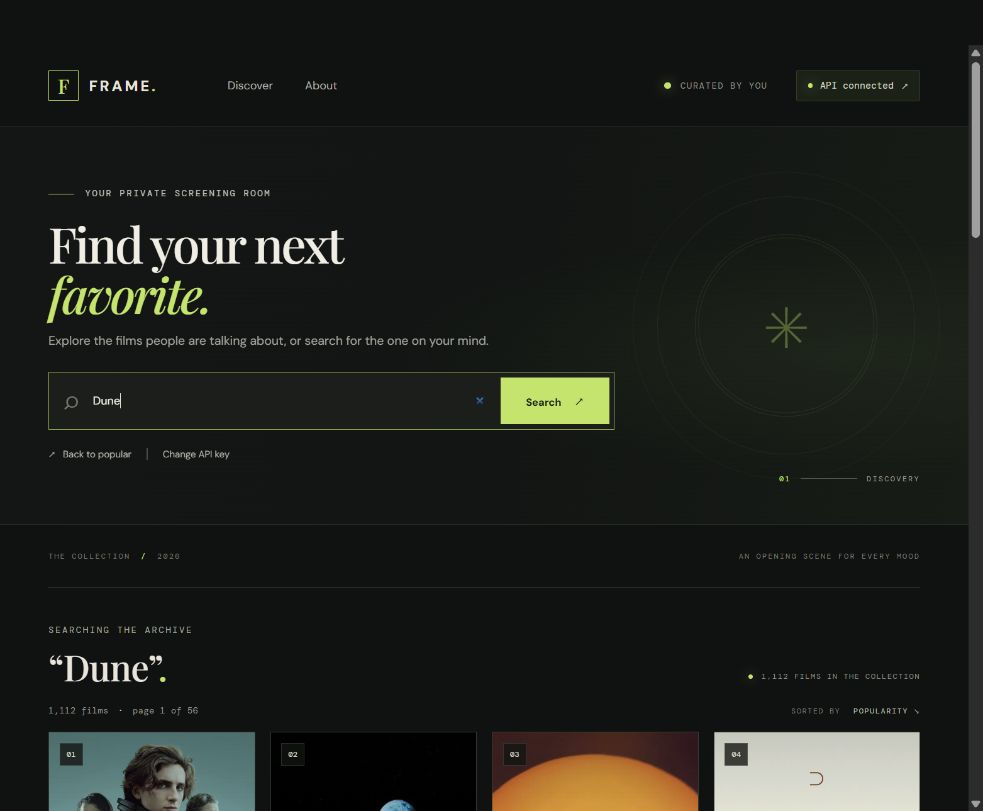
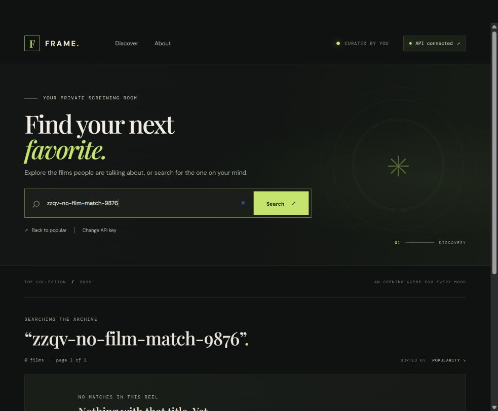
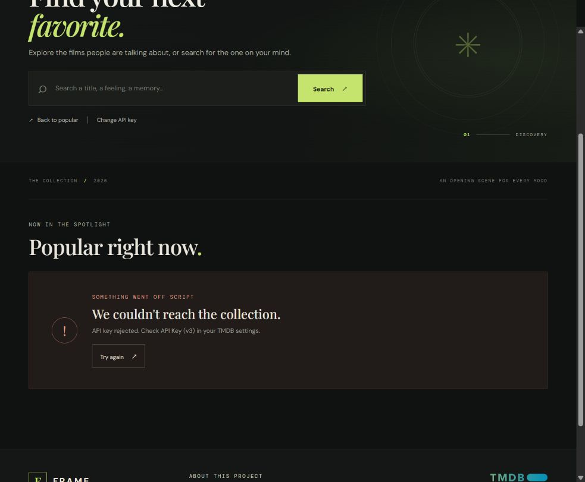

# Movie Lab

**A personal cinema for discovering films.** FRAME. is a cinematic, responsive movie-discovery website powered by live data from The Movie Database (TMDB). Bring your own TMDB API Key (v3) to browse popular movies, search the catalog, and move through results.

**Live site:** [teobodev.github.io/movie-lab](https://teobodev.github.io/movie-lab/)

**Assignment report:** [Movie Lab Assignment 2 (PDF)](Movie_Lab_Assignment_2_Report.pdf)



## Screenshots

| Popular collection | Live movie search |
| --- | --- |
|  |  |

| Empty search | API key error |
| --- | --- |
|  |  |

## Features

- Popular movies and title search use live TMDB API responses.
- Paginated results, poster artwork, ratings, release dates, overviews, and direct TMDB movie links.
- Responsive movie-card grid with a missing-artwork fallback.
- Loading, no-results, timeout, and API error states with retry and recovery actions.
- Use or change your own API Key (v3); the key stays in tab memory and is cleared on page reload.
- Accessible keyboard focus states and reduced-motion support.
- Static frontend; no backend or database is required.

## Technology

- Vue 3
- Vite 8
- The Movie Database (TMDB) API
- GitHub Actions and GitHub Pages

## Run locally

Requirements: Node.js 22.18+ or 24.12+.

```sh
npm ci
npm run dev
```

Open the local URL printed by Vite (typically `http://localhost:5173/movie-lab/`). To create and preview the production build:

```sh
npm run build
npm run preview
```

The build output is written to `dist/`.

## TMDB API setup

1. Create or sign in to a TMDB account and request an API key at [TMDB API settings](https://www.themoviedb.org/settings/api).
2. Copy the **API Key (v3)** from your TMDB API settings. This app expects the v3 key, not the separate API Read Access Token.
3. Open Movie Lab and enter the key on the welcome screen. Select **Enter the cinema** to load real popular movies.
4. Search by title, use the page controls to browse more results, or choose **Change API key** to clear it and return to the welcome screen.

The app sends the supplied key in TMDB requests from the browser. It is held only in memory for the current tab: it is not saved to local storage or included in this repository or build. Movie information and posters require an internet connection. For background on API authentication, see [TMDB's developer documentation](https://developer.themoviedb.org/docs/getting-started).

## Deployment

GitHub Actions builds the Vite site and deploys `dist/` to GitHub Pages after each push to `main`; it can also be run manually from the Actions tab. The Vite base path is configured for this repository at `/movie-lab/`.

To enable Pages on a new repository, open **Settings → Pages** and set **Build and deployment → Source** to **GitHub Actions**. The deployment workflow requires only `contents: read`, `pages: write`, and `id-token: write` permissions.

## Project structure

```text
movie-lab/
├── .github/workflows/deploy-pages.yml  # Build and publish to GitHub Pages
├── public/                             # Static files and favicon
├── screenshots/                        # Real website captures used above
├── src/
│   ├── components/MovieCard.vue        # Movie poster and metadata card
│   ├── assets/                         # TMDB attribution logo
│   ├── api.js                           # TMDB requests and poster URLs
│   ├── App.vue                          # Connection, search, results, and states
│   └── style.css                        # Responsive visual system
├── index.html
├── vite.config.js
├── package.json
└── LICENSE
```

## Credits and license

Movie data, posters, and the TMDB logo are provided by or attributed to TMDB. This product uses the TMDB API but is not endorsed or certified by TMDB. See [CREDITS.md](CREDITS.md) for logo attribution.

Project source is available under the MIT License; this does not grant rights to TMDB materials or third-party dependencies. See [LICENSE](LICENSE).

Maintained by [**teobodev**](https://github.com/teobodev).

© 2026 [teobodev](https://github.com/teobodev).
